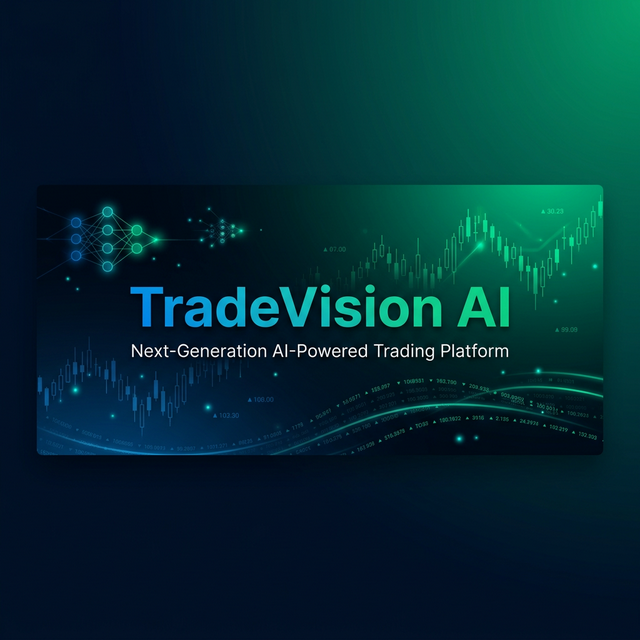
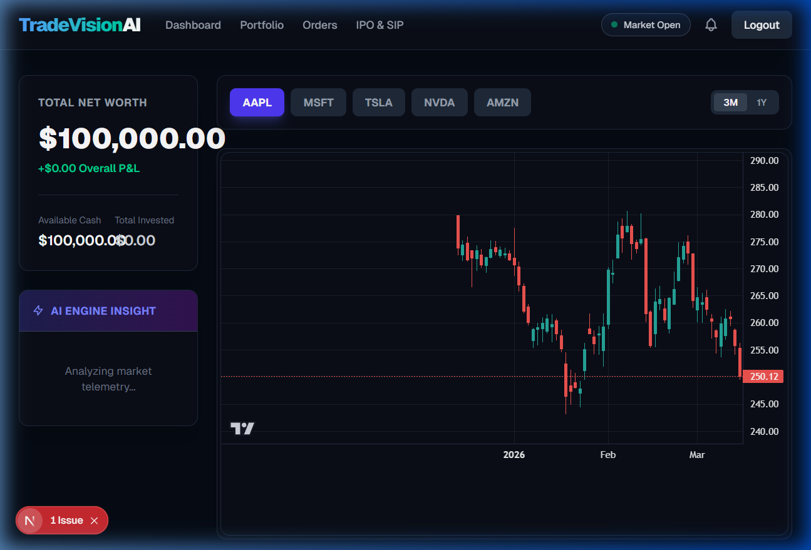
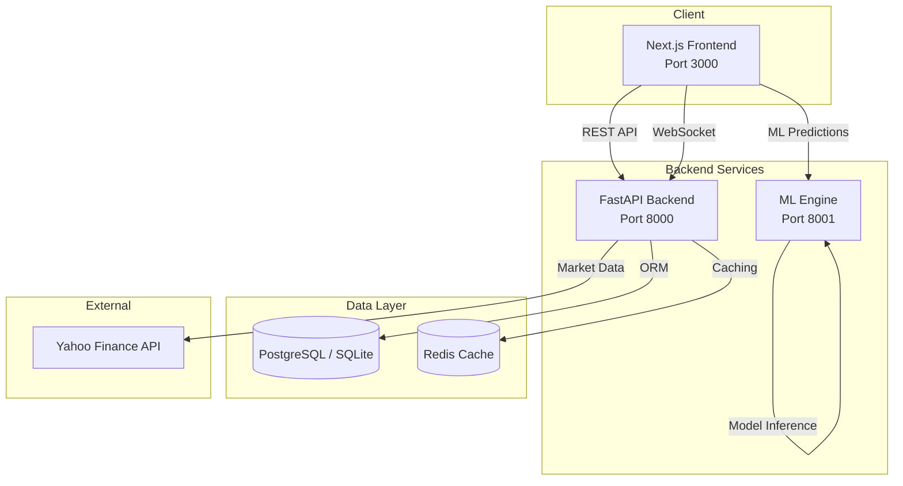

<p align="center">
  
</p>

<p align="center">
  <strong>🚀 A production-grade, AI-powered stock market trading platform built for scale.</strong>
</p>

<p align="center">
  <a href="#features"></a>
  <a href="#tech-stack"></a>
  <a href="#tech-stack"></a>
  <a href="#tech-stack"></a>
  <a href="#license"></a>
</p>

<p align="center">
  <a href="#quick-start">Quick Start</a> •
  <a href="#features">Features</a> •
  <a href="#architecture">Architecture</a> •
  <a href="#tech-stack">Tech Stack</a> •
  <a href="#api-docs">API Docs</a> •
  <a href="#contributing">Contributing</a>
</p>

---

## 📸 Screenshots

<p align="center">
  
</p>

---

## ✨ Features

### 🏦 Core Trading
- **Real-Time Market Data** — Live stock prices powered by Yahoo Finance
- **Instant Order Execution** — Place market BUY/SELL orders with real-time price matching
- **Portfolio Management** — Track holdings, P&L, and total equity in real-time
- **Order History** — Full audit trail of all executed and pending trades

### 📊 Advanced Charting
- **Professional Candlestick Charts** — Powered by TradingView's Lightweight Charts v5
- **Multi-Ticker Support** — Switch between AAPL, MSFT, TSLA, NVDA, AMZN
- **3-Month & 1-Year Views** — Historical OHLCV data visualization

### 🤖 AI & Machine Learning
- **ML Price Prediction Engine** — PyTorch + XGBoost models for stock price forecasting
- **AI Trading Insights** — Confidence-scored BUY/HOLD/SELL recommendations
- **Real-Time Analysis** — Continuous market telemetry processing

### 💼 Investment Products
- **IPO Applications** — Apply for upcoming Initial Public Offerings
- **Systematic Investment Plans (SIP)** — Set up automated monthly investments

### 🔐 Security
- **JWT Authentication** — Secure token-based auth with 7-day expiry
- **Bcrypt Password Hashing** — Industry-standard password protection
- **CORS Protection** — Configurable cross-origin resource sharing

---

## 🏗️ Architecture

```
TradeVision AI/
├── 🔙 backend/              # FastAPI REST API server
│   ├── api/                  # Route handlers (auth, orders, market, portfolio, websockets)
│   ├── core/                 # Security & config (JWT, bcrypt)
│   ├── database/             # SQLAlchemy ORM + SQLite/PostgreSQL
│   ├── models/               # Data models (User, Order, Portfolio, Holding)
│   ├── schemas/              # Pydantic request/response schemas
│   └── main.py               # FastAPI application entry point
│
├── 🎨 frontend/              # Next.js 16 React application
│   └── src/
│       ├── app/              # App Router pages (dashboard, orders, portfolio, ipo, login)
│       ├── components/       # Reusable components (Navbar, TradingChart)
│       └── utils/            # API client with JWT interceptors
│
├── 🧠 ml-engine/             # Machine Learning prediction service
│   └── (FastAPI + PyTorch + XGBoost + scikit-learn)
│
├── 🐳 deployment/            # Docker configurations
│   └── docker/               # Dockerfiles for each service
│
├── 📊 data_pipeline/         # Data ingestion & preprocessing
│
└── 🐙 docker-compose.yml     # Multi-service orchestration
```

### System Design



---

## 🛠️ Tech Stack

| Layer | Technology |
|-------|-----------|
| **Frontend** | Next.js 16, React 19, TypeScript, Tailwind CSS 4, TradingView Charts |
| **Backend** | FastAPI, SQLAlchemy 2.0, Pydantic v2, Uvicorn |
| **ML Engine** | PyTorch, XGBoost, scikit-learn, NumPy, Pandas |
| **Database** | PostgreSQL (prod) / SQLite (dev) |
| **Cache** | Redis 7 |
| **Auth** | JWT (python-jose) + Bcrypt |
| **Market Data** | Yahoo Finance (yfinance) |
| **DevOps** | Docker, Docker Compose, GitHub Actions |

---

## 🚀 Quick Start

### Prerequisites

- **Python 3.12+**
- **Node.js 18+**
- **Git**

### 1. Clone the Repository

```bash
git clone https://github.com/AgolaPriyank/TradeVision-AI.git
cd TradeVision-AI
```

### 2. Start the Backend

```bash
cd backend
python -m venv venv

# Windows
.\venv\Scripts\activate

# macOS/Linux
source venv/bin/activate

pip install -r requirements.txt
uvicorn main:app --reload --port 8000
```

> 🟢 Backend running at **http://localhost:8000**
> 📄 API Docs at **http://localhost:8000/docs**

### 3. Start the Frontend

```bash
cd frontend
npm install
npm run dev
```

> 🟢 Frontend running at **http://localhost:3000**

### 4. Start the ML Engine *(Optional)*

```bash
cd ml-engine
python -m venv venv
.\venv\Scripts\activate   # Windows
pip install -r requirements.txt
uvicorn main:app --reload --port 8001
```

### 🐳 Docker (Alternative)

```bash
docker compose up --build
```

This starts all services: PostgreSQL, Redis, Backend, ML Engine, and Frontend.

---

## 📡 API Docs

Once the backend is running, visit the interactive API documentation:

| Docs | URL |
|------|-----|
| **Swagger UI** | [http://localhost:8000/docs](http://localhost:8000/docs) |
| **ReDoc** | [http://localhost:8000/redoc](http://localhost:8000/redoc) |

### Key Endpoints

| Method | Endpoint | Description |
|--------|----------|-------------|
| `POST` | `/api/v1/auth/register` | Register a new user |
| `POST` | `/api/v1/auth/login` | Login & get JWT token |
| `GET` | `/api/v1/market/history/{symbol}` | Get OHLCV history |
| `POST` | `/api/v1/orders/` | Place a BUY/SELL order |
| `GET` | `/api/v1/orders/` | Get order history |
| `GET` | `/api/v1/portfolio/` | Get portfolio & holdings |

---

## 📁 Project Structure

```
📦 TradeVision AI
 ┣ 📂 backend
 ┃ ┣ 📂 api          → auth.py, orders.py, market.py, portfolio.py, websockets.py
 ┃ ┣ 📂 core         → security.py (JWT + Bcrypt)
 ┃ ┣ 📂 database     → database.py (SQLAlchemy engine)
 ┃ ┣ 📂 models       → user.py, order.py, portfolio.py
 ┃ ┣ 📂 schemas      → user.py, order.py
 ┃ ┗ 📜 main.py      → FastAPI app with CORS + routers
 ┣ 📂 frontend
 ┃ ┗ 📂 src
 ┃   ┣ 📂 app        → dashboard, orders, portfolio, ipo, login pages
 ┃   ┣ 📂 components → Navbar.tsx, TradingChart.tsx
 ┃   ┗ 📂 utils      → api.ts (Axios + JWT interceptors)
 ┣ 📂 ml-engine      → PyTorch/XGBoost prediction service
 ┣ 📂 deployment     → Docker configs
 ┣ 📂 data_pipeline  → Data ingestion scripts
 ┗ 📜 docker-compose.yml
```

---

## 🤝 Contributing

Contributions are welcome! Here's how:

1. **Fork** the repository
2. **Create** your feature branch: `git checkout -b feature/amazing-feature`
3. **Commit** your changes: `git commit -m 'Add amazing feature'`
4. **Push** to branch: `git push origin feature/amazing-feature`
5. **Open** a Pull Request

---

## 📄 License

This project is licensed under the **MIT License** — see the [LICENSE](LICENSE) file for details.

---

## 👤 Author

**Priyank Agola**

- GitHub: [@AgolaPriyank](https://github.com/AgolaPriyank)

---

<p align="center">
  Built with ❤️ using FastAPI, Next.js & PyTorch
</p>
